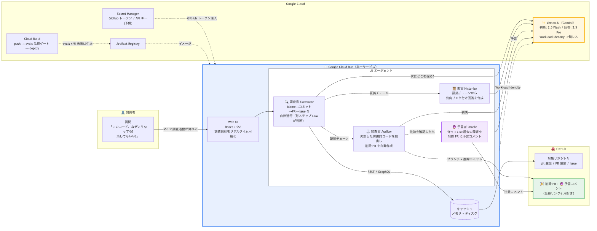

# 🏺 Code Archaeologist

**「なぜこのコードはこうなっているのか?」に、証拠付きで答える AI エージェント。**

git 履歴・PR 議論・Issue を自律的に遡行横断してコードの意思決定の因果関係を再構築し、「理由が失効したコード」には発掘した証拠を根拠として添えた削除 PR を自動作成します。

> DevOps × AI Agent Hackathon 2026（Findy 主催 / Google Cloud 協賛）提出作品

| | |
|---|---|
| 🌐 **デモ（動作確認用 URL）** | https://code-archaeologist-66wzqrw33q-an.a.run.app |
| 🧪 **デモ対象リポジトリ** | https://github.com/nabe3m/demo-repo （実際の開発現場によくある「歴史のある嘘」を再現） |
| 🎉 **エージェントが実際に作成した削除 PR（Oracle の予言コメント付き）** | https://github.com/nabe3m/demo-repo/pull/14 |

## 解決する課題

コードベースには「消したいが、消してよいか誰にも分からないコード」が堆積します。書いた本人は退職し、理由はやり取りの奥に埋もれ、`git blame` しても「なぜ」まではたどり着けない。結果、**理由が失効した防御的コード**（不要になった sleep、リトライ、分岐）が残り続け、あらゆる変更を遅く・怖くします。

Code Archaeologist は、この「コードの考古学」を AI エージェントが代行します。

## 3人のエージェント

| 役割 | 何をするか |
|------|-----------|
| 🔍 **調査官 Excavator** | 対象コード行から git blame → コミット → PR → 議論 → Issue を再帰的に遡行。**「次にどこを掘るか」を毎ステップ LLM が自律判断**し、判断理由を構造化イベントとしてリアルタイム配信 |
| 📜 **史官 Historian** | 証拠チェーンから「いつ・誰が・なぜ・当時の制約・その制約は現在も有効か」を、**実在の PR/Issue へのリンク付き**で回答。証拠ゼロのときは正直に「分からない」と答える（引用の捏造を構造的に防止） |
| ⚖️ **監査官 Auditor** | 防御的コードを検出 → 発掘 → **失効確認（Issue/PR の前方検索を強制実行）** → 引用付きの判決 → 失効なら削除 PR を GitHub 上に実作成。削除 PR には Oracle が「守っていた障害」を予言コメントとして残す |

### デモシナリオ: 消せない `sleep(3)` の考古学

[demo-repo](https://github.com/nabe3m/demo-repo) の `orders/api.py:15` には `time.sleep(3)` があります。

1. 2024-03: 在庫 API v1 が結果整合のため書き込み直後の読み取りが 404 に（[Issue #1](https://github.com/nabe3m/demo-repo/issues/1)）
2. 対症療法として `sleep(3)` を追加。「**v2 が出たら真っ先に消す**」条件で承認（[PR #2](https://github.com/nabe3m/demo-repo/pull/2)）
3. 2024-11: v2（read-your-writes 保証）へ移行。しかし sleep の削除は「別タスク」として先送りされ、**消し忘れた**（[PR #4](https://github.com/nabe3m/demo-repo/pull/4)）

「このコード、消していい?」— 監査官はこの歴史を発掘し、証拠 10 件を引用した[削除 PR](https://github.com/nabe3m/demo-repo/pull/14) を自動作成します。さらに🔮予言者 Oracle が、この sleep が守っていた過去の障害（Issue #1 の 404）を[削除 PR へのコメント](https://github.com/nabe3m/demo-repo/pull/14#issuecomment-4936010078)として残します。

一方、同じファイルの決済リトライ（[Issue #9](https://github.com/nabe3m/demo-repo/issues/9) / [PR #10](https://github.com/nabe3m/demo-repo/pull/10): プロバイダのレート制限は「増枠予定なし」）は、**制約がまだ生きていると判定して「維持すべき」と宣言し、削除 PR を作りません**。監査官は「防御的コードを消す機械」ではなく、歴史を読んで生死を見分けます。

## 使い方（デモ URL で試す）

1. デモ URL を開く（demo-repo の対象行がプリセット済み）
2. **⛏️ 発掘する** — 調査官の遡行判断が右ペインにリアルタイムで流れ、下部に出典リンク付きの回答が出ます
3. **⚖️ 監査する** — ファイル全体から失効した防御的コードを検出し、判決と削除 PR リンクまで一気通貫

任意の公開リポジトリ・ファイル・行番号を指定して発掘することもできます。

## アーキテクチャ



- **単一 Cloud Run サービス**: FastAPI が React SPA を配信し、調査過程は **SSE** でストリーム。デモ URL 1つで完結
- **調査過程 = 構造化イベント**: 調査官の全判断（何を根拠に次へ掘ったか）を `dig_decision` / `evidence_found` 等のイベントとして発行。UI・構造化ログ・デモ動画の素材が1つの仕組みから出る
- **GitHub キャッシュ**（メモリ + ディスク）: デモがレート制限で死なない
- **LLM は Vertex AI 経由（鍵レス）**: Cloud Run のサービスアカウント + Workload Identity で認証し、ランタイムは Gemini の API キーを持たない。`GOOGLE_GENAI_USE_VERTEXAI` の切替1つで Developer API にも即戻せる
- **CD + 品質ゲート**: `cloudbuild.yaml` により push → ビルド → **evals をデプロイ前に実行（4/5 未満はデプロイ中止）** → Cloud Run デプロイ。プロンプト・モデル変更のデグレが本番に届かない。シークレットは Secret Manager
- ただし evals ゲートは Developer API キーで実行されており、本番の Vertex AI 認証経路自体は検証しない（Vertex 側の障害時は `GOOGLE_GENAI_USE_VERTEXAI=false` への env 切替1コマンドでロールバック可能）

## 技術選定の理由

**エージェント基盤: google-genai SDK 直利用 + 自前遡行ループ**（ADK は Day 1 スパイクの結果、不採用）

Day 1 に ADK（Agent Development Kit）のスパイクを実施（`spikes/adk_spike.py`）。ADK でも blame → コミット → PR → Issue の自律遡行ループ自体は動作したが、以下の理由で自前ループを採用した:

1. **判断の構造化**: 本プロダクトの核は「調査官の各判断」を UI タイムラインへリアルタイム配信すること。ADK では判断理由が自由テキストイベントとして流れ、ツール呼び出しイベントとのペアリングとパースが必要になる。自前ループでは Gemini の structured output で `Decision(tool, args, reason)` をスキーマ保証付きで取得でき、そのまま SSE イベントになる
2. **テスト容易性**: 遡行ループの停止条件・証拠の重複排除・掘り先候補の管理はデモの安定性に直結するため TDD で実装（37 テスト）。LLM 判断を関数として注入する設計により、ループ自体を決定的にテストできる
3. **依存の軽さ**: ADK は依存 50 パッケージ超。Cloud Run のイメージサイズとコールドスタートに響く

**LLM の満足化バイアスへの構造的対策**（live 検証からのフィードバック）:

- **エラー結果のフィードバック**: 失敗したツール呼び出しは結果付きで実行履歴として LLM に渡し、同じ間違いを繰り返させない
- **finish の自己点検**: 未消化の手がかりを残したままの調査終了は一度差し戻して再考させる
- **監査官の失効確認は強制実行**: 「当時の制約がその後解消されたか」の確認は監査の定義そのものなので、LLM の裁量に任せず監査官自身が Issue/PR 検索を実行する
- **引用の捏造防止**: 史官は証拠ゼロのとき LLM を呼ばず「見つからなかった」と答える

**モデルの使い分け**: 調査官の毎ステップ判断は Gemini 2.5 Flash（高頻度・低コスト）、史官の最終回答のみ Gemini 2.5 Pro（1回・品質勝負）。環境変数 `EXCAVATOR_MODEL` / `HISTORIAN_MODEL` で差し替え可能。

## セットアップ

```bash
uv sync
cp .env.example .env  # GEMINI_API_KEY / GITHUB_TOKEN を設定

# テスト
uv run pytest

# CLI で発掘
uv run archaeologist nabe3m/demo-repo orders/api.py 15 "この sleep(3) はなぜあるの?"

# CLI で監査（削除 PR を実作成するので注意）
uv run archaeologist-audit nabe3m/demo-repo orders/api.py

# Web UI（http://localhost:8080）
cd frontend && npm ci && npm run build && cd ..
uv run uvicorn code_archaeologist.web:app --port 8080
```

### Cloud Run へのデプロイ

```bash
gcloud builds submit --config cloudbuild.yaml --substitutions SHORT_SHA=$(git rev-parse --short HEAD) .
```

事前に Artifact Registry リポジトリ `app`（asia-northeast1）と Secret Manager の `gemini-api-key` / `github-token` を作成しておきます。

## 評価（evals/）

回答の品質を「正しい一次資料を引用できたか」で採点する考古学クイズを用意しています（LLM の文言ゆらぎに依存しない採点方式）。

```bash
uv run python evals/run.py
```

現在 **5/5**（LLM の揺らぎで時折 4/5）。この evals は **Cloud Build の品質ゲート**としてデプロイ前に毎回実行され、`--min-pass 4` を下回るとデプロイが中止されます（プロンプト・モデル変更のデグレを本番前に検出）。開発中には実際のバグを2つ捕捉しました:

1. 「調査官がコミットメッセージで満足して PR 議論まで掘らない」早期終了バイアス → 監査官の「失効確認の強制実行」設計につながった
2. **structured output のツール enum に `search_issues` が漏れており、モデルが検索を「選べなかった」**という決定的なスキーマバグ → プロンプト改善で直らない挙動の根本原因を evals の失敗が特定した

## 今後の拡張

- **私有リポジトリ対応 / GitHub App 化**: 現在は PAT。組織導入には App インストール型が適切
